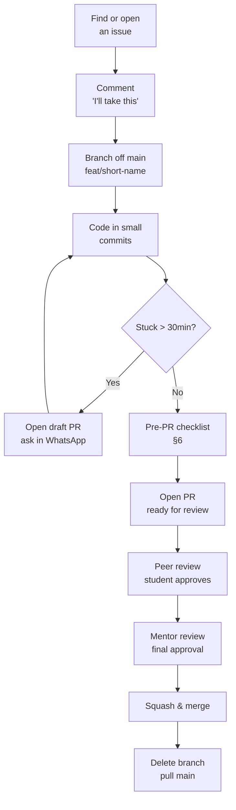
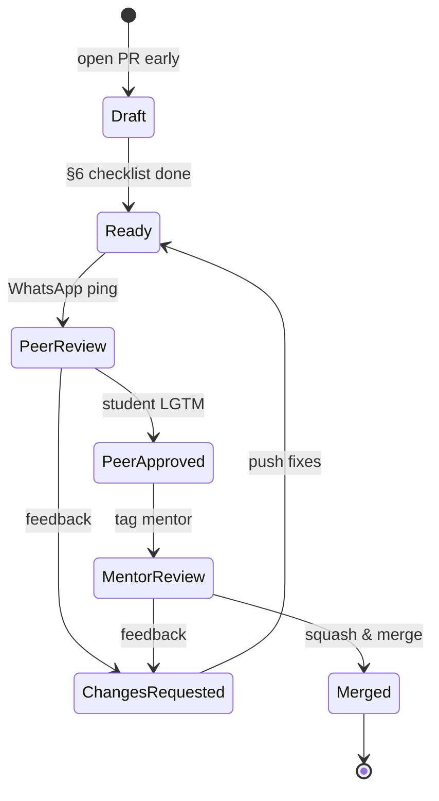
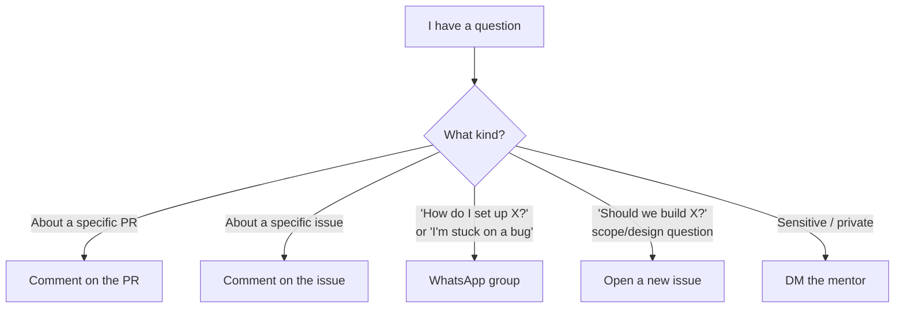

# Contributing

Welcome. This guide is written for **students who have never contributed to a team project before.** If you've only ever pushed code to your own repos, this is the gap-filler — the *team* part of working on code with other people.

Read this once end-to-end before your first PR. It's long because the social workflow matters as much as the git commands; skim sections you already know.

## The whole loop at a glance



Everything below is detail on each step. If you only remember the diagram, you'll be fine.
---

## Table of contents

1. [The mindset](#1-the-mindset)
2. [Before you touch code](#2-before-you-touch-code)
3. [Setting up locally](#3-setting-up-locally)
4. [Branching and naming](#4-branching-and-naming)
5. [Making changes](#5-making-changes)
6. [The pre-PR checklist](#6-the-pre-pr-checklist)
7. [Opening a pull request](#7-opening-a-pull-request)
8. [Code review: receiving and giving](#8-code-review-receiving-and-giving)
9. [Communication norms](#9-communication-norms)
10. [Common first-timer mistakes](#10-common-first-timer-mistakes)
11. [Your first PR: a full walkthrough](#11-your-first-pr-a-full-walkthrough)
12. [Future: when we add CI](#12-future-when-we-add-ci)

---

## 1. The mindset

Contributing to a team project is different from solo coding in three ways:

- **Other people read your code.** They will not have your context. Write for them.
- **Smaller is better.** A PR that changes 30 lines gets merged today. A PR that changes 800 lines sits open for a week and gets abandoned.
- **Asking is faster than guessing.** If you're stuck for more than ~30 minutes, ask. Nobody on this team will judge you for asking — they *will* notice if you disappear for three days and come back with the wrong thing built.

The single biggest mistake first-timers make: working in silence, hoping to surprise the team with finished work. Don't. Show progress early, ask questions, post your branch as a draft PR even when it's half-broken.

---

## 2. Before you touch code

### Pick an issue

1. Go to the repo's **Issues** tab. *An "issue" is a GitHub-tracked task, bug, or discussion — usually where work begins.*
2. Look for issues labeled `good-first-issue` or `help-wanted`.
3. Read the whole issue. Read the comments too — someone might already be working on it.
4. **Comment on the issue:** *"I'd like to take this — planning to start [today/this week]. Will ask if I get stuck."* This is how you claim it. No claim = someone else might do it in parallel.

### Don't start work the team didn't ask for

If you have an idea that isn't an open issue — **open the issue first**, describe what you want to build and why, wait for a reply from the mentor or another student. Five minutes of discussion before you code can save five hours of rewriting after review.

### Ask clarifying questions early

When you read an issue and something is ambiguous, ask in the issue comments. Examples of good questions:

- "Should this handle the case where MedlinePlus returns no results, or is that out of scope?"
- "Is there a preferred library for X, or should I pick one?"
- "I see two ways to do this — A or B. Which fits the existing code better?"

Don't ask "how do I do this?" with no context. Ask specific, narrow questions that show you've already thought about it.

---

## 3. Setting up locally

Follow [README.md](./README.md) for environment setup, and read [GUIDE.md](./GUIDE.md) for *why* the project is structured the way it is.

When setup breaks (it will):

1. Read the error message. Actually read it — not just the last line.
2. Search the issue tracker for the error.
3. Search Google / Stack Overflow.
4. Ask in WhatsApp with: (a) what you tried, (b) the exact error, (c) your OS. Screenshots are fine but **paste the error text too** so it's searchable later.

"It doesn't work" is not a question anyone can answer. "I ran `python -m backend.scripts.ingest` on Windows 11, got `ModuleNotFoundError: No module named 'backend'`, my venv is activated and I'm in the repo root" is a question with an answer.

---

## 4. Branching and naming

**Never commit directly to `main`.** Always branch.

> *Quick vocabulary:*
> - **Branch** — a parallel line of work in the repo. You make one for each change so `main` stays clean.
> - **`main`** — the branch that holds the "real" code everyone shares. Treat it as read-only; never push to it directly.
> - **Commit** — a saved snapshot of your changes with a short message. Like a checkpoint you can roll back to.

Branch naming convention:

```
<type>/<short-description>
```

Where `<type>` is one of:

| Type     | When to use                                         |
| -------- | --------------------------------------------------- |
| `feat`   | New feature or capability                           |
| `fix`    | Bug fix                                             |
| `docs`   | Documentation only (README, GUIDE, comments)        |
| `refactor` | Restructuring code without changing behavior      |
| `test`   | Adding or fixing tests                              |
| `chore`  | Dependency bumps, build config, housekeeping        |

Examples:

```
feat/entity-extractor-prompt
fix/streamlit-empty-input-crash
docs/guide-phase-2-diagrams
```

**One branch = one concern.** If you fix a typo while implementing a feature, that's fine — but don't bundle "add new endpoint" with "rewrite the ingestion pipeline" in the same branch. Two unrelated changes = two branches = two PRs.

---

## 5. Making changes

### Commit often, commit small

A commit should be one logical change. "Add entity extractor" is one commit. "Add entity extractor, fix three bugs, rename a file, and update README" is four commits.

Commit message format:

```
<type>: <short imperative summary>

<optional longer body explaining why, not what>
```

Good:
- `feat: add entity extractor service`
- `fix: handle empty MedlinePlus response in ingestion`
- `docs: explain graph traversal in GUIDE §7`

Bad:
- `update`
- `stuff`
- `fixed it`
- `WIP` (fine on your local branch, squash before PR)

### Ask for help mid-task

If you're 2 hours in and stuck, open a **draft PR** (see §7) and ask in WhatsApp: *"Drafted #42 — stuck on the graph traversal, would love a second pair of eyes."* This is normal and expected. It's not "asking for help with homework" — it's how teams work.

---

## 6. The pre-PR checklist

Before you open a PR, run through this list. The point is: catch your own mistakes before a reviewer has to.

- [ ] **The app actually runs.** Start the backend (`uvicorn backend.app.main:app --reload`) and the frontend (`streamlit run app.py`). Open the UI. Try the feature you changed.
- [ ] **You didn't break unrelated things.** Try one or two flows you *didn't* touch. If the chat box broke because you changed the ingestion script, that's a problem.
- [ ] **No secrets in the diff.** *(The "diff" is the set of lines added/removed by your changes — what reviewers actually look at.)* Search your changes for API keys, passwords, `.env` *(a local file holding secrets like API keys — never committed)* contents, hardcoded paths from your machine.
- [ ] **No commented-out dead code.** If you removed something, remove it. Don't leave `# old version:` blocks.
- [ ] **No `print()` debug statements** unless they're intentional logs.
- [ ] **Tests pass** if the project has tests for the area you touched. (Currently sparse — will tighten as the project grows.)
- [ ] **README / GUIDE updated** if you changed architecture, added a new dependency, or changed how to run something.
- [ ] **Your branch is up to date with `main`.** Run `git pull origin main` into your branch and resolve any conflicts.

We don't have automated CI yet — see §12 — so this checklist *is* the quality bar.

---

## 7. Opening a pull request

> *A **pull request** (PR) is a proposal on GitHub to merge your branch into `main`. It's the unit of contribution — every change ships through a PR.*

### Title

Same format as a commit message:

```
feat: add entity extractor service
```

Short, imperative, under 70 characters. The title shows up in the merge log forever.

### Description

Use this template:

```markdown
## What

One or two sentences on what this PR does.

## Why

What problem does it solve? Link the issue: "Closes #42"

## How

The approach you took. Mention any non-obvious choices.

## Testing

What did you do to verify it works? (Even if it's "ran it locally, tried these three inputs.")

## Screenshots / GIFs

If it touches the UI, paste a screenshot. Drag-and-drop into the GitHub PR description works.
```

### Draft vs ready

- **Draft PR** — work in progress, not ready for full review, but you want feedback or visibility. Use this *liberally*. It's not embarrassing; it's good practice.
- **Ready for review** — you believe it's done. Mark it ready when you've finished §6.

### PR lifecycle



Two approvals required: one peer, one mentor. Either can send the PR back to "changes requested" — that's normal, not failure. (*"LGTM" = "Looks Good To Me", reviewer shorthand for approval.*)

### Asking for review

After marking ready:

1. Post in the WhatsApp group: *"PR #42 ready for review — would anyone like to take it?"*
2. Wait for a student to volunteer.
3. Once a student has reviewed and approved, **tag the mentor** (`@<mentor-github-handle>`) in a PR comment for final review.

Two approvals (one peer, one mentor) = ready to merge.

---

## 8. Code review: receiving and giving

This is the part nobody teaches in school. Get this right and you'll be better than 80% of working engineers.

### When you receive a review

- **Reviews are about the code, not you.** "This function is doing too much" is not "you are bad." Separate the two in your head, every time.
- **Read every comment fully before reacting.** Don't push back on comment #1 before you've seen #5.
- **It's okay to disagree.** Reply with your reasoning: *"I went with X because Y — happy to switch if you'd still prefer the other."* That's a conversation, not insubordination.
- **It's okay to be wrong.** "Good catch, fixing" is a complete and respected response.
- **Don't take "request changes" personally.** It just means "address these before merge." It is not a grade.
- **Mark comments resolved when you've addressed them.** Don't resolve a comment if you just *disagreed* and moved on — leave it open so the reviewer can respond.

### When you give a review

- **Be specific.** "This is confusing" is not actionable. "I had trouble following the loop on line 42 because the variable `x` is also used outside it — could it be renamed?" is.
- **Be kind.** Frame as questions where possible: *"Was there a reason to use a list here instead of a set?"* lands better than *"This should be a set."*
- **Distinguish nits from blockers.** A *nit* (short for "nitpick") is a tiny style preference, not a real problem. Prefix those comments with `nit:` so the author knows they can ignore or address. Reserve "request changes" for things that are actually wrong.
- **Praise things you like.** "Nice — this is much cleaner than what was there before" is valid review feedback and makes people want to keep contributing.
- **Don't rewrite their PR in the comments.** If you'd do it totally differently, talk to them in WhatsApp before dumping 40 comments.

The two-button distinction:

- **Comment** — feedback, not blocking. Author can merge after addressing.
- **Request changes** — blocking. Author must respond before merge.
- **Approve** — looks good to me, ready to merge (pending other approvals).

Use "request changes" sparingly. Default to "comment."

---

## 9. Communication norms

- **Async is the default.** *("Async" = communication where you don't expect an instant reply — the opposite of a live conversation.)* WhatsApp is not a chat room expecting instant replies. Post your question, then keep working on something else. Expect a response within a day, not a minute.
- **Write so the reader can pick up cold.** "It's not working" tells nobody anything. "Backend crashes on startup with `ImportError: cannot import name 'X'` after I added the new service — full traceback below" is answerable.
- **One thread per topic.** If you have three unrelated questions, send three messages, not one wall.
- **Update your PRs.** If you got feedback and pushed a fix, leave a comment: *"Addressed all comments, ready for re-review."* Don't assume reviewers are watching for new commits.
- **If you can't finish what you claimed**, say so. *"I'm not going to be able to finish #42 this week — unassigning so someone else can pick it up."* That is a *good* message to send. *Ghosting* — disappearing from a claimed issue or PR without saying anything — is the only thing that hurts the team.

### Where do I ask this?



Default to **public** channels (PR, issue, WhatsApp). Public questions help the next student who hits the same thing.

---

## 10. Common first-timer mistakes

- **Committing directly to `main`.** Always branch.
- **Force-pushing a shared branch.** *(A "force push" overwrites the remote branch's history instead of adding to it — it can erase other people's commits.)* Never `git push --force` to `main` or to a branch someone else is also working on. Force-pushing your *own* PR branch is fine.
- **Committing `.env` or secrets.** Check your diff. If `.env` shows up, stop and fix `.gitignore` *(the file listing paths git should never track)*.
- **Giant PRs.** If your PR has 600+ lines changed and isn't an auto-generated file, split it.
- **PRs with no description.** "See title" is not a description.
- **Ghosting a review.** If a reviewer left feedback 4 days ago and you haven't replied, the PR is dying. Reply even if it's *"Haven't had time, will get to it by Friday."*
- **Working on something for a week without showing anyone.** Open a draft PR on day one.
- **Resolving review comments by editing the original comment thread.** Reply or push a fix; don't quietly edit.
- **Merging your own PR without approvals.** Don't.

---

## 11. Your first PR: a full walkthrough

Let's go through the entire loop end-to-end with the smallest possible change: **fixing a typo in GUIDE.md**.

This walkthrough assumes you have a GitHub account and `git` installed.

### Step 1 — Fork the repo (if you're external) or clone it (if you have access)

> *Quick vocab:* **Clone** = download the repo to your laptop so you can edit it. **Fork** = make your own GitHub copy of someone else's repo (used when you can't push directly to theirs).

If you have write access to the repo (most students will):

```bash
git clone <repo-url-placeholder>
cd telemed-AI
```

If you don't have write access yet, click **Fork** on the GitHub repo page, then clone your fork instead.

### Step 2 — Make sure `main` is up to date

```bash
git checkout main
git pull origin main
```

### Step 3 — Create a branch

You found a typo in GUIDE.md — say, "recieve" instead of "receive".

```bash
git checkout -b docs/fix-guide-typo
```

### Step 4 — Make the change

Open `GUIDE.md`, find "recieve", change it to "receive", save.

### Step 5 — Check what you changed

```bash
git status
git diff
```

`git status` lists changed files. `git diff` shows the actual changes. **Always look at your diff before committing.** This is the single best habit to build.

### Step 6 — Stage and commit

```bash
git add GUIDE.md
git commit -m "docs: fix typo in GUIDE.md"
```

Note: `git add GUIDE.md`, not `git add .` — being explicit prevents accidentally committing files you didn't mean to.

### Step 7 — Push the branch

```bash
git push -u origin docs/fix-guide-typo
```

The `-u` sets the *upstream* (the remote branch your local branch is linked to) so future `git push` commands from this branch work without arguments.

### Step 8 — Open the PR on GitHub

Go to the repo on GitHub. You'll see a yellow banner: *"docs/fix-guide-typo had recent pushes — Compare & pull request."* Click it.

Fill in the template:

```
## What
Fix "recieve" → "receive" typo in GUIDE.md §3.

## Why
Small documentation polish.

## How
Single character change.

## Testing
N/A — docs only.
```

Click **Create pull request**.

### Step 9 — Ask for review

Post in WhatsApp:

> PR #N up — tiny typo fix in GUIDE. Would anyone mind reviewing?

A student volunteers, reviews, approves. Then in a PR comment:

> Thanks! `@<mentor-github-handle>` ready for final review.

### Step 10 — Address feedback (if any)

If the reviewer leaves comments:

1. Make the fixes locally.
2. `git add <files>`, `git commit -m "address review feedback"`, `git push`.
3. Reply to each comment on GitHub explaining what you changed (or why you disagreed).
4. Re-request review.

### Step 11 — Merge

After mentor approval, the mentor (or you, if given permission) clicks **Merge pull request**. Use **Squash and merge** by default — *"squash"* combines all your PR's commits into one tidy commit on `main`, keeping its history clean.

Delete the branch when prompted. On your laptop:

```bash
git checkout main
git pull origin main
git branch -d docs/fix-guide-typo
```

You've now done a full contribution cycle. Every PR you ever open follows this same shape — only the middle (Step 4) gets bigger.

---

## 12. Future: when we add CI

Right now there's no GitHub Actions setup. Quality is enforced by the §6 checklist + human review.

> *Vocab:* **CI** = "Continuous Integration", automated checks that run on every PR. **Lint** = an automated style/quality checker (e.g. `ruff`) that flags common code issues.

When the project grows (probably once 2-3 students are comfortable with the workflow), we'll add a `.github/workflows/ci.yml` that runs lint and tests automatically on every PR. At that point:

- PRs will show a green check or red X near the merge button.
- **Red X = do not merge.** Fix the failure, push again, wait for green.
- This doesn't replace human review — it just catches the boring stuff (lint, broken tests) so reviewers can focus on the interesting stuff (design, correctness).

This section will be updated when CI lands.

---

## Questions?

Open an issue, ask in WhatsApp, or tag the mentor on a PR. There is no such thing as a stupid question on this project — only questions that never got asked.
