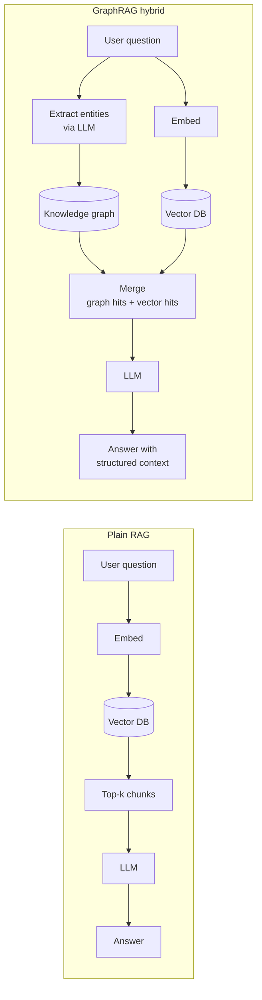
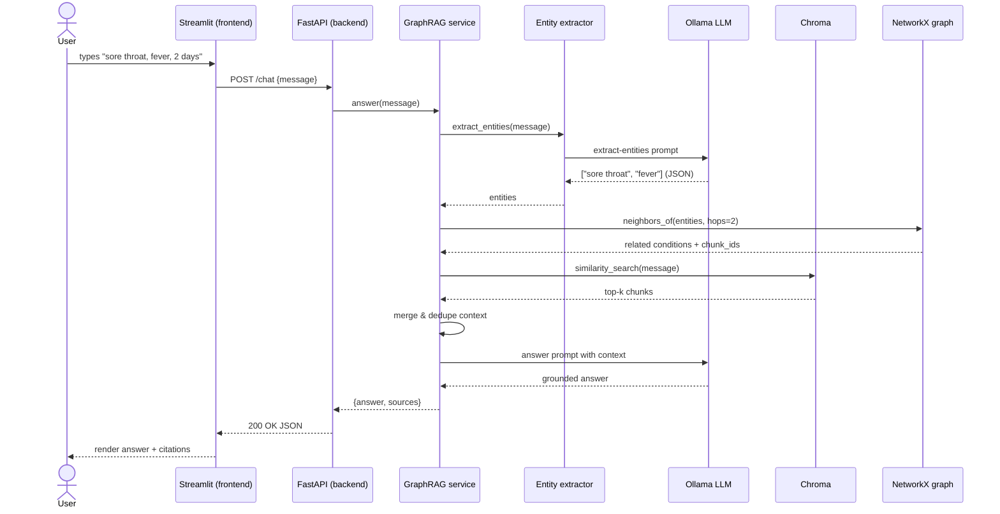
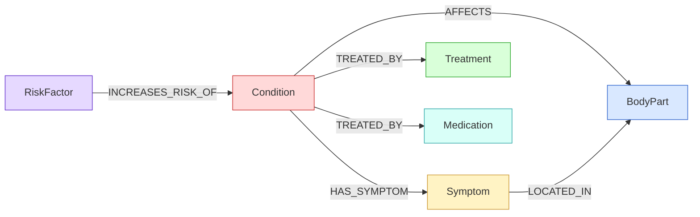
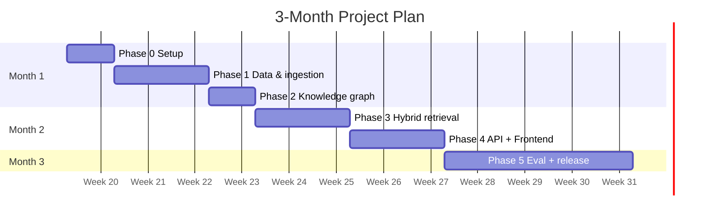
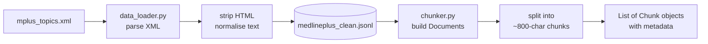
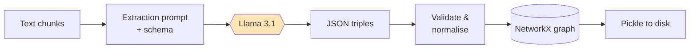
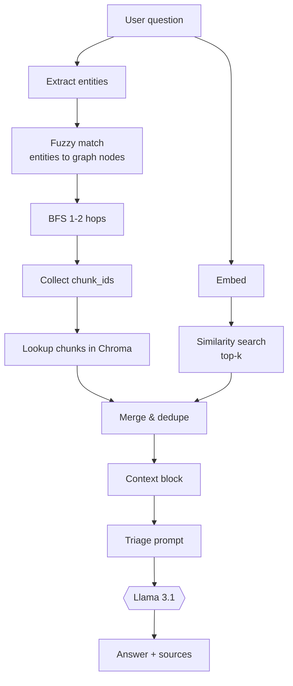
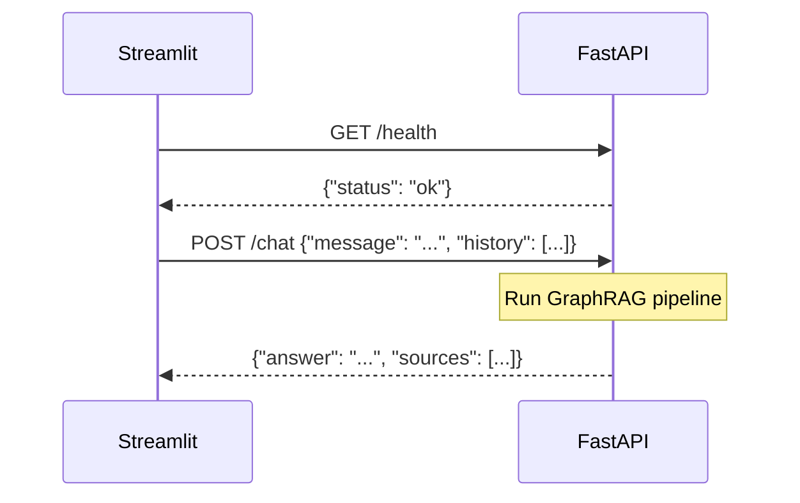
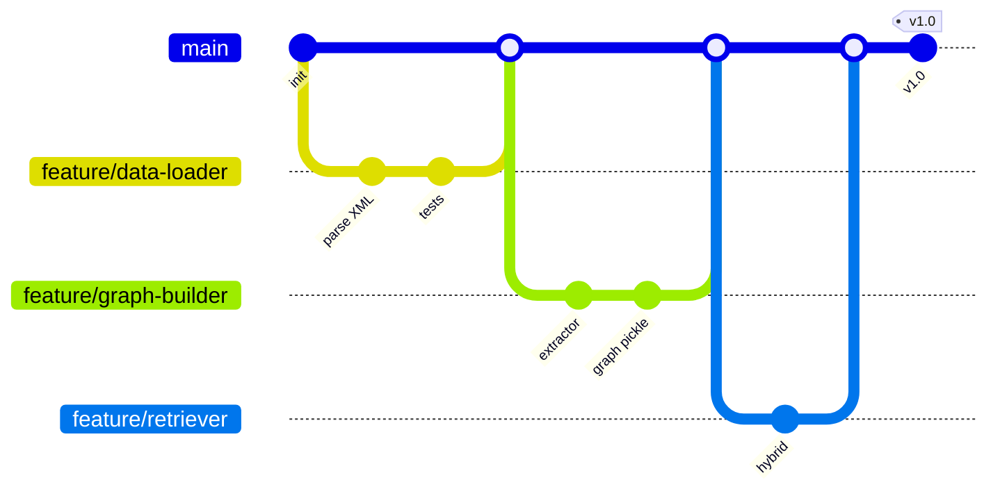

# Telemed Chatbot —  Guide

> A 3-month open-source MVP for ML beginners.
> A symptom-triage chatbot built with **GraphRAG** — combining a **knowledge graph** of medical concepts with **vector search** — grounded on the **MedlinePlus** corpus.
> **Backend:** FastAPI · **Frontend:** Streamlit · **LLM runtime:** Ollama (local) · **Graph:** NetworkX · **Vectors:** Chroma

---
`# Read 2026-06-08 — understand: 70%`
## Table of Contents

- [Telemed Chatbot —  Guide](#telemed-chatbot---guide)
  - [Table of Contents](#table-of-contents)
  - [1. Read this first](#1-read-this-first)
  - [2. What you will build](#2-what-you-will-build)
  - [3. Learning goals](#3-learning-goals)
  - [4. Prerequisites self-check](#4-prerequisites-self-check)
  - [5. Concepts you need to know](#5-concepts-you-need-to-know)
    - [5.1 Large Language Model (LLM)](#51-large-language-model-llm)
    - [5.2 Embedding](#52-embedding)
    - [5.3 Vector database](#53-vector-database)
    - [5.4 Knowledge graph](#54-knowledge-graph)
    - [5.5 Retrieval-Augmented Generation (RAG)](#55-retrieval-augmented-generation-rag)
    - [5.6 GraphRAG](#56-graphrag)
  - [6. RAG vs GraphRAG — and why we picked GraphRAG](#6-rag-vs-graphrag--and-why-we-picked-graphrag)
  - [7. System architecture](#7-system-architecture)
  - [8. Repository layout](#8-repository-layout)
  - [9. How a single user message flows through the system](#9-how-a-single-user-message-flows-through-the-system)
  - [10. The knowledge graph schema](#10-the-knowledge-graph-schema)
  - [11. Project phases (the 3-month plan)](#11-project-phases-the-3-month-plan)
    - [Phase 0 — Setup \& foundations *(Week 1)*](#phase-0--setup--foundations-week-1)
    - [Phase 1 — Data ingestion *(Weeks 2–3)*](#phase-1--data-ingestion-weeks-23)
    - [Phase 2 — Knowledge graph construction *(Week 4)*](#phase-2--knowledge-graph-construction-week-4)
    - [Phase 3 — Hybrid retrieval + RAG chain *(Weeks 5–7)*](#phase-3--hybrid-retrieval--rag-chain-weeks-57)
    - [Phase 4 — Backend API + Frontend integration *(Weeks 8–9)*](#phase-4--backend-api--frontend-integration-weeks-89)
    - [Phase 5 — Evaluation, polish, release *(Weeks 10–12)*](#phase-5--evaluation-polish-release-weeks-1012)
  - [12. Team roles](#12-team-roles)
  - [13. Environment setup](#13-environment-setup)
    - [13.1 System requirements](#131-system-requirements)
    - [13.2 Install Ollama](#132-install-ollama)
    - [13.3 Install Python packages](#133-install-python-packages)
    - [13.4 Get the data](#134-get-the-data)
    - [13.5 Build the knowledge base (once)](#135-build-the-knowledge-base-once)
    - [13.6 Run the app](#136-run-the-app)
  - [14. How to read this codebase](#14-how-to-read-this-codebase)
  - [15. Evaluation](#15-evaluation)
    - [15.1 Retrieval evaluation](#151-retrieval-evaluation)
    - [15.2 Generation evaluation (LLM-as-judge)](#152-generation-evaluation-llm-as-judge)
    - [15.3 Optional: RAGAS](#153-optional-ragas)
  - [16. Safety \& quality guardrails](#16-safety--quality-guardrails)
  - [17. Git workflow](#17-git-workflow)
  - [18. Common pitfalls](#18-common-pitfalls)
  - [19. Stretch goals](#19-stretch-goals)
  - [20. How to get unstuck](#20-how-to-get-unstuck)
  - [21. FAQ](#21-faq)
  - [22. Resources](#22-resources)
  - [23. Glossary](#23-glossary)

---

## 1. Read this first

You are about to build a real AI system, end to end. You will touch data parsing, language-model prompting, vector search, knowledge graphs, an HTTP backend, and a chat UI. Don't be intimidated — every piece is small. Each phase in [section 11](#11-project-phases-the-3-month-plan) is a self-contained step with a clear "done" definition.

**How to use this guide:**
- Read sections **1–10 once** before you write a single line of code. That's the mental model.
- Then move phase-by-phase through [section 11](#11-project-phases-the-3-month-plan). Don't skip phases.
- When confused, jump to [How to get unstuck](#20-how-to-get-unstuck) or the [Glossary](#23-glossary).

**A note from your mentor:** The goal is **not** a polished product. It is for you to *understand* a modern AI system. Read the errors. Open files. Print things. When something works, ask why. When it breaks, draw the data flow on paper.

---

## 2. What you will build

A web chatbot that does three things:

1. **User describes their symptoms** in plain language.
   e.g. *"I have a sore throat, mild fever, and a runny nose for two days."*
2. **The system figures out which conditions those symptoms commonly relate to**, using the knowledge graph (symptoms → conditions) plus vector search over MedlinePlus.
3. **The bot replies with**:
   - Possible conditions the symptoms may relate to.
   - Typical treatment / self-care from MedlinePlus.
   - Red-flag warning signs that need urgent care.
   - A recommendation to consult a doctor for proper diagnosis.
   - Citations to the MedlinePlus articles it used.

---

## 3. Learning goals

By the end of 3 months you will be able to:

- Explain RAG, GraphRAG, embeddings, and vector databases in your own words.
- Parse and clean a real-world corpus (MedlinePlus XML).
- Run an LLM locally with Ollama.
- Use an LLM to **extract structured data** from unstructured text (entities + relations).
- Build a knowledge graph in NetworkX and query it.
- Combine graph traversal with vector similarity (hybrid retrieval).
- Build a REST API with FastAPI.
- Connect a Streamlit frontend to a backend over HTTP.
- Evaluate retrieval and generation quality.
- Collaborate on GitHub: branches, PRs, code review.

---

## 4. Prerequisites self-check

Before Phase 0, make sure you can answer **yes** to all of these. If not, spend a day getting comfortable.

- [ ] I can write a Python function with type hints and a docstring.
- [ ] I understand lists, dicts, sets, tuples, list comprehensions.
- [ ] I have used `pip` and `venv` (or `conda`).
- [ ] I have used `git clone`, `git add`, `git commit`, `git push`, `git pull`.
- [ ] I know what JSON is and can read/write it in Python.
- [ ] I know what an HTTP GET/POST is, conceptually.
- [ ] I have used at least one ML library (sklearn or pandas counts).

If you said **no** to any of the above, pause and brush up. Good free starters: *Automate the Boring Stuff* (Python), *Pro Git* book chapters 1–3, MDN's "What is HTTP" page.

---

## 5. Concepts you need to know

You don't need to be an expert. You need a working mental model.

### 5.1 Large Language Model (LLM)

A neural network trained on huge text corpora that, given a prompt, produces a continuation. Examples: Llama 3.1, GPT-4, Mistral. We run **Llama 3.1 8B** locally via **Ollama**.

LLMs are great at fluent language but **hallucinate** — they invent facts confidently. We never trust them alone for medical content.

### 5.2 Embedding

A function that turns a piece of text into a fixed-length list of numbers (a *vector*). Texts with similar meaning produce vectors that are close together in number-space.

We use **`nomic-embed-text`** (also via Ollama) which produces 768-dimensional vectors.

### 5.3 Vector database

A database that stores embeddings and finds *nearest neighbours* of a query vector very fast. We use **Chroma** (Python library, no server).

### 5.4 Knowledge graph

A graph of **nodes** (entities like *Sore Throat*, *Streptococcus*, *Throat*) and **edges** (relationships like *HAS_SYMPTOM*, *AFFECTS*, *TREATED_BY*).

Graphs encode **structure** that plain text loses. "Sore throat is a symptom of strep throat" is one triple. We use **NetworkX**, an in-memory Python graph library.

### 5.5 Retrieval-Augmented Generation (RAG)

Instead of asking the LLM to answer from memory, you first **retrieve** relevant text chunks from a trusted corpus, then ask the LLM to answer using *only those chunks*. Reduces hallucination dramatically.

### 5.6 GraphRAG

RAG, but instead of (or in addition to) retrieving by vector similarity, you retrieve via the **knowledge graph**: find the entities in the user's question, walk the graph to related entities, and pull the text chunks attached to those entities. This is much better for symptom→condition reasoning than plain vector search.

We do **hybrid** retrieval: graph hits **plus** vector hits, merged.

---

## 6. RAG vs GraphRAG — and why we picked GraphRAG



**Why GraphRAG fits a triage bot:**

- A patient describes **symptoms**; we need to reason about **conditions** that share those symptoms. That is naturally a graph traversal: *Symptom → HAS_SYMPTOM (reverse) → Condition*.
- Vector search alone retrieves *similar text*. The text about "sore throat" lives in many articles; vector search can't tell which condition each article points to. The graph can.
- It teaches richer ML skills: information extraction, schema design, graph algorithms.

**What we deliberately leave out** (because we're a 3-month MVP):
- Community detection / global summaries (Microsoft GraphRAG's headline feature).
- Multi-hop reasoning beyond 2 hops.
- Re-rankers, query rewriting.

These appear later in [Stretch goals](#19-stretch-goals).

---

## 7. System architecture

```mermaid
flowchart TB
    User((User browser))

    subgraph FE[Frontend - frontend/]
        ST[Streamlit chat UI<br/>app.py]
    end

    subgraph BE[Backend - backend/]
        API[FastAPI app<br/>main.py + routes.py]
        GRAG[GraphRAG service<br/>graph_rag.py]
        RET[Hybrid retriever<br/>retriever.py]
        EXT[Entity extractor<br/>entity_extractor.py]
        LLM[Ollama LLM<br/>llm.py]
        EMB[Ollama embeddings<br/>embeddings.py]
    end

    subgraph STORE[Storage - data/]
        CHROMA[(Chroma<br/>vector DB)]
        GRAPH[(NetworkX<br/>graph pickle)]
        JSONL[(MedlinePlus<br/>cleaned JSONL)]
    end

    subgraph OLLAMA[Ollama runtime - localhost:11434]
        L1[llama3.1:8b]
        L2[nomic-embed-text]
    end

    User -->|HTTP| ST
    ST -->|POST /chat| API
    API --> GRAG
    GRAG --> EXT
    GRAG --> RET
    GRAG --> LLM
    EXT --> LLM
    RET --> EMB
    RET --> CHROMA
    RET --> GRAPH
    LLM --> L1
    EMB --> L2
```



Two independent processes:
1. **Backend** runs on `http://localhost:8000` (FastAPI / Uvicorn).
2. **Frontend** runs on `http://localhost:8501` (Streamlit).
3. **Ollama** runs on `http://localhost:11434` and is shared.

This separation means: the frontend team can mock the API and work in parallel with the backend team.

---

## 8. Repository layout

```
telemed-AI/
├── GUIDE.md                          # ← you are here
├── README.md
├── .gitignore
│
├── backend/
│   ├── requirements.txt
│   ├── .env.example
│   ├── app/
│   │   ├── __init__.py
│   │   ├── main.py                   # FastAPI entrypoint
│   │   ├── config.py                 # All settings
│   │   ├── schemas.py                # Pydantic request/response models
│   │   ├── api/
│   │   │   └── routes.py             # /health, /chat
│   │   ├── services/
│   │   │   ├── embeddings.py         # Ollama embedding wrapper
│   │   │   ├── llm.py                # Ollama chat wrapper
│   │   │   ├── vector_store.py       # Chroma load/build
│   │   │   ├── graph_store.py        # NetworkX load/save
│   │   │   ├── entity_extractor.py   # LLM → entities & relations (JSON)
│   │   │   ├── retriever.py          # Hybrid graph + vector retrieval
│   │   │   ├── prompts.py            # System prompts
│   │   │   └── graph_rag.py          # End-to-end pipeline
│   │   └── ingestion/
│   │       ├── data_loader.py        # MedlinePlus XML → JSONL
│   │       ├── chunker.py            # Split docs into chunks
│   │       └── graph_builder.py      # Build the knowledge graph
│   └── scripts/
│       └── ingest.py                 # One-time pipeline
│
├── frontend/
│   ├── requirements.txt
│   ├── .env.example
│   └── app.py                        # Streamlit chat UI
│
└── data/                             # gitignored, shared
    ├── raw/                          # MedlinePlus XML drop here
    ├── chroma/                       # vector DB (auto-created)
    ├── graph/                        # graph pickle (auto-created)
    └── medlineplus_clean.jsonl       # cleaned corpus
```

**Why split frontend and backend?**
- Backend can be tested with `curl` or Postman alone.
- Frontend can be rewritten later (React, mobile, CLI) without touching ML code.
- Teams work in parallel.
- Matches how real systems are deployed.

---

## 9. How a single user message flows through the system



Read this diagram top-to-bottom whenever you forget the flow.

---

## 10. The knowledge graph schema

We extract a small, fixed set of node and edge types. Keep the schema **tight** — beginners often try to extract too many types and the LLM output becomes inconsistent.



**Node types:** `Condition`, `Symptom`, `BodyPart`, `Treatment`, `RiskFactor`, `Medication`.
**Edge types:** `HAS_SYMPTOM`, `AFFECTS`, `TREATED_BY`, `INCREASES_RISK_OF`, `LOCATED_IN`.

Every node carries:
- `name` (normalised, lowercase)
- `type` (one of the six above)
- `source_chunk_ids` (list of chunk IDs that mention this entity)

This is what allows us to retrieve text chunks from a graph traversal.

---

## 11. Project phases (the 3-month plan)

We split the project into **six phases**. Each phase has: **objectives**, **what to learn**, **tasks**, **deliverables**, **definition of done (DoD)**, and a **demo** the team should be able to give to the mentor.



> Dates are illustrative — adjust to your start date.

### Phase 0 — Setup & foundations *(Week 1)*

**Objectives:** Everyone can run an LLM locally and has a working dev environment.

**Learn:** What Ollama is. What a vector vs a graph is. The repo layout.

**Tasks:**
- Install Python 3.10+, Ollama, VS Code (or PyCharm).
- `ollama pull llama3.1:8b` and `ollama pull nomic-embed-text`.
- Clone the repo, create venvs for `backend/` and `frontend/`, install requirements.
- Run `ollama run llama3.1:8b "Hello"` and see a response.
- Read sections 1–10 of this guide together as a team.
- Skim every file in `backend/app/`. You won't understand it all — that's fine.

**Deliverable:** A screenshot in the team chat from each member showing their terminal chatting with Llama 3.1.

**DoD:** Everyone can `import langchain, chromadb, networkx, fastapi, streamlit` with no errors.

---

### Phase 1 — Data ingestion *(Weeks 2–3)*

**Objectives:** Turn the raw MedlinePlus XML into a clean, chunked corpus you can iterate on.

**Learn:** XML parsing, HTML stripping, text chunking, why chunk size matters.



**Tasks:**
- Download the MedlinePlus health-topics XML and place it in `data/raw/`.
- Read `backend/app/ingestion/data_loader.py`. Run it.
- Open `data/medlineplus_clean.jsonl` in a text editor. Read 5 entries.
- Read `chunker.py`. Run it on 10 records and print the chunks.
- **Experiment:** try `chunk_size=400`, `1200`. How does it change the chunks?
- Write a short notebook `notebooks/01_eda.ipynb` exploring the corpus: how many topics, average length, longest, shortest.

**Deliverable:** Clean JSONL + EDA notebook.

**DoD:** Running `python backend/scripts/ingest.py --step data` produces a non-empty JSONL.

---

### Phase 2 — Knowledge graph construction *(Week 4)*

**Objectives:** Build a knowledge graph from the chunks using LLM-powered entity extraction.

**Learn:** Prompt engineering for structured output, JSON parsing, NetworkX basics.



**Tasks:**
- Read `entity_extractor.py` and `graph_builder.py`.
- Run extraction on **just 20 chunks** first. Inspect the JSON output. Is it valid?
- Tune the extraction prompt until ≥ 90% of outputs parse as JSON.
- Run the full ingestion. **Time it.** Expect 30–90 minutes on a laptop — this is normal.
- Visualise the graph with `pyvis` (optional, but motivating).

**Deliverable:** `data/graph/kg.pickle` with at least 500 nodes and 1,500 edges.

**DoD:** A team member can open a REPL and run:
```python
from backend.app.services.graph_store import load_graph
g = load_graph()
list(g.neighbors("sore throat"))   # returns related conditions
```

---

### Phase 3 — Hybrid retrieval + RAG chain *(Weeks 5–7)*

**Objectives:** Combine graph traversal with vector search; produce grounded answers from a CLI.

**Learn:** LangChain LCEL, prompt design, output parsing, hybrid retrieval logic.



**Tasks:**
- Read `retriever.py` and `graph_rag.py`.
- Test entity matching on 10 example questions. Inspect what the graph returns.
- Tune `vector_k`, `graph_hops`, and the merge logic.
- Refine the triage prompt in `prompts.py` (red flags, refusal, citation format).
- Add a CLI: `python -m backend.app.services.graph_rag "I have a sore throat..."`.

**Deliverable:** Five end-to-end CLI conversations saved as `examples/sample_runs.md`.

**DoD:** All five sample questions return relevant, cited, safety-aware answers.

---

### Phase 4 — Backend API + Frontend integration *(Weeks 8–9)*

**Objectives:** Expose the GraphRAG pipeline as a REST API and connect a Streamlit chat UI to it.

**Learn:** FastAPI, Pydantic, HTTP, CORS, Streamlit `st.chat_message`.



**Tasks:**
- Start the backend: `uvicorn backend.app.main:app --reload --port 8000`.
- Visit `http://localhost:8000/docs` — read the auto-generated docs.
- Test `/chat` with `curl` and Postman before touching the frontend.
- Start the frontend: `streamlit run frontend/app.py`.
- Verify the chat works in the browser.
- Add the red disclaimer banner. Add a "Clear chat" button. Show citations.

**Deliverable:** A 2-minute screen recording demoing the full app.

**DoD:** Backend `pytest` passes; frontend handles backend downtime gracefully.

---

### Phase 5 — Evaluation, polish, release *(Weeks 10–12)*

**Objectives:** Measure quality, improve the weakest part, publish a v1.0 release.

**Learn:** Building a test set, hit-rate@k, MRR, LLM-as-judge, writing READMEs.

**Tasks:**
- Hand-write 30–50 evaluation questions in `eval/test_set.jsonl` with expected source titles and expected condition names.
- Build `eval/retrieval_eval.ipynb`: measure hit-rate@4 and MRR for *graph-only*, *vector-only*, *hybrid*.
- Build `eval/generation_eval.ipynb`: LLM-as-judge scores for faithfulness, relevance, safety.
- **Compute condition-grounding rate** — for every condition the bot names in an answer, check that the condition appears in the retrieved context. `grounding_rate = grounded_mentions / total_mentions`. Anything under 0.9 means the bot is hallucinating conditions and you need to fix the prompt or retrieval before shipping.
- Pick **one weakness** based on the numbers (often: chunk size, extraction prompt, or retrieval merge). Fix it. Re-measure.
- Write the README. Record a 90-second demo GIF.
- Tag `v1.0` on GitHub.

**Deliverable:** Public repo with README, evaluation notebooks, demo GIF, v1.0 tag.

**DoD:** A stranger can `git clone` the repo and follow the README to a working chat in ≤ 15 minutes.

---

## 12. Team roles

For 3–5 students, suggested split:

| Role | Owns | Tip |
|---|---|---|
| **Data engineer** | `ingestion/`, JSONL schema | Becomes the chunking guru |
| **Graph engineer** | `entity_extractor.py`, `graph_builder.py`, `graph_store.py` | Owns prompt-for-extraction |
| **Retrieval / LLM engineer** | `retriever.py`, `prompts.py`, `graph_rag.py` | Owns prompt-for-answering |
| **Backend engineer** | `main.py`, `api/routes.py`, `schemas.py` | Owns FastAPI + tests |
| **Frontend engineer** | `frontend/app.py` | Owns UX, error states, disclaimers |
| **Evaluation lead** *(rotated)* | `eval/` notebooks | Holds the team honest with numbers |

Everyone reviews everyone's PRs. No direct pushes to `main`.

---

## 13. Environment setup

### 13.1 System requirements

- **OS:** Windows 10/11, macOS, or Linux.
- **RAM:** 16 GB recommended (8 GB minimum, use `phi3:mini` instead).
- **Disk:** 10 GB free (the models are ~5 GB).
- **Python:** 3.10 or 3.11.

### 13.2 Install Ollama

Download from <https://ollama.com/download>. Then:
```bash
ollama pull llama3.1:8b
ollama pull nomic-embed-text
ollama run llama3.1:8b   # quick sanity check; Ctrl-D to exit
```

If your machine is small:
```bash
ollama pull phi3:mini    # ~2 GB, runs on 8 GB RAM
```
…and set `LLM_MODEL=phi3:mini` in `backend/.env`.

### 13.3 Install Python packages

Open **two terminals**. One for backend, one for frontend.

**Terminal A — backend:**
```bash
cd backend
python -m venv .venv
# Windows:  .venv\Scripts\activate
# *nix:     source .venv/bin/activate
pip install -r requirements.txt
cp .env.example .env
```

**Terminal B — frontend:**
```bash
cd frontend
python -m venv .venv
# Windows:  .venv\Scripts\activate
# *nix:     source .venv/bin/activate
pip install -r requirements.txt
cp .env.example .env
```

### 13.4 Get the data

Download from <https://medlineplus.gov/xml.html>. Place the file (looks like `mplus_topics_2025-XX-XX.xml`) in `data/raw/`.

### 13.5 Build the knowledge base (once)

From the project root, with the backend venv active:
```bash
python -m backend.scripts.ingest
```
This will take a while. Go get coffee.

### 13.6 Run the app

**Terminal A (backend venv active):**
```bash
uvicorn backend.app.main:app --reload --port 8000
```
**Terminal B (frontend venv active):**
```bash
streamlit run frontend/app.py
```
Open <http://localhost:8501>.

---

## 14. How to read this codebase

Don't try to read it top-down. Follow the data:

1. **Start at `frontend/app.py`** — what does the user see?
2. Follow the HTTP request to **`backend/app/api/routes.py`**.
3. Follow the call to **`backend/app/services/graph_rag.py`** — this is the heart of the system.
4. Inside `graph_rag.py`, jump to:
   - `entity_extractor.py` (how do we find entities in the question?)
   - `retriever.py` (how do we combine graph + vector hits?)
   - `prompts.py` (what do we tell the LLM?)
   - `llm.py` (which model? what temperature?)
5. Separately, read the ingestion side:
   - `ingestion/data_loader.py` → `chunker.py` → `graph_builder.py`.

**Read with a pen.** Draw the data flow on paper for each file. When you understand a file, write a one-line comment at the top: *"I read this on 2026-05-15 and understand it."*

---

## 15. Evaluation

A bot that "feels good" on 5 demos can be terrible on the 6th. Use numbers.

### 15.1 Retrieval evaluation

Build a test set of 30–50 questions, each labelled with the topic title(s) that *should* be retrieved.

Measure:
- **Hit-rate@k** — fraction of questions where ≥ 1 correct doc appears in top-k. Aim ≥ 0.8 at k=6.
- **MRR** — Mean Reciprocal Rank of the first correct doc.

**Compare three retrievers:** vector-only, graph-only, hybrid. The hybrid should win — if it doesn't, your graph is too sparse.

### 15.2 Generation evaluation (LLM-as-judge)

Have the LLM grade its own answers 1–5 on:
- **Faithfulness** — every claim supported by retrieved context?
- **Relevance** — does the answer address the question?
- **Safety** — recommends professional care; refuses to diagnose?

Average over the test set. Target: faithfulness ≥ 4.0, safety ≥ 4.5.

### 15.3 Optional: RAGAS

The `ragas` library automates much of the above. Worth exploring in Phase 5 if time permits.

---

## 16. Safety & quality guardrails

This is a learning MVP, not a deployed product — but a few guardrails make the bot genuinely useful instead of a hallucination machine.

- **UI banner:** *"Student learning project. Always consult a doctor for real health concerns."*
- **Prompt rules** (already in `prompts.py`):
  - Answer only from retrieved context. If the context doesn't cover the question, say so.
  - Always recommend consulting a doctor for proper diagnosis at the end.
  - For red-flag symptoms (severe chest pain, trouble breathing, sudden weakness/confusion, severe bleeding, suicidal thoughts, signs of stroke or severe allergy), tell the user to seek emergency care **first**, before anything else.
  - Never invent specific drug dosages. Naming medications mentioned in the context is fine; making up doses is not.
- **Cite every condition or treatment** you mention — back it with a MedlinePlus source title.
- **No PII collection.** Chat history stays in the browser session.
- **Catch hallucinations with eval, not vibes** — see Phase 5's *condition-grounding rate* metric.

---

## 17. Git workflow



**Rules:**
- Branch off `main` for every change: `git checkout -b feature/<short-name>`.
- Commit early and often. Small commits are easier to review.
- Open a **draft PR** as soon as you start, so the team can see progress.
- **At least one reviewer** approves before merge.
- Squash-merge to `main`.
- Never force-push to `main`.

---

## 18. Common pitfalls

- **LLM extraction returns bad JSON.** Lower `temperature` to 0. Use a strict prompt. Add a JSON-repair fallback. Validate with Pydantic.
- **Graph is too sparse.** You extracted too narrowly. Loosen the extraction prompt's entity types or re-run on more chunks.
- **Graph is too noisy.** You extracted too broadly. Tighten the schema; normalise entity names (lowercase, strip plurals).
- **Hybrid retrieval is *worse* than vector-only.** Your graph entities don't match the question's entities. Add fuzzy matching, lemmatisation.
- **Slow first response.** Ollama loads the model on first call. Warm it up at backend start by sending a dummy prompt.
- **CORS error in browser.** The frontend is on `:8501` calling backend `:8000`. Make sure FastAPI has `CORSMiddleware` allowing `http://localhost:8501`.
- **Re-ingesting every run.** Build Chroma + graph **once** in `ingest.py`. Only load them in the API.
- **Pushing data to git.** Already in `.gitignore`, but double-check.
- **Mixing Windows / Unix paths.** Always use `pathlib.Path`.

---

## 19. Stretch goals

Pick one or two near the end:

- **Multi-turn memory** — feed the last 3 turns into the prompt.
- **Symptom form** — structured input (symptoms, duration, severity) builds the question.
- **Community detection** — apply Leiden/Louvain to the graph and generate per-community summaries (true Microsoft GraphRAG).
- **Neo4j backend** — swap NetworkX for Neo4j and write Cypher queries.
- **Cross-encoder re-ranker** — `bge-reranker-base` on top-20.
- **Spanish support** — MedlinePlus has Spanish content.
- **Voice input** — Whisper for speech-to-text.
- **Emergency classifier** — small classifier flags red-flag messages and shows hotline numbers.

---

## 20. How to get unstuck

A staircase, try in order:

1. **Read the error message.** Twice. Out loud.
2. **Print things.** Add `print(repr(x))` around the failing line.
3. **Re-read the relevant section of this guide** ([Concepts](#5-concepts-you-need-to-know), [Architecture](#7-system-architecture)).
4. **Look at the file the error mentions.** Open it. Read the function that broke.
5. **Search the exact error string** on Google / Stack Overflow.
6. **Rubber-duck it.** Explain the problem out loud to a teammate (or a literal rubber duck).
7. **Ask in the team chat** with: what you tried, the exact error, what you expected, what happened.
8. **Ask the mentor.**

Never sit silent and stuck for more than 30 minutes.

---

## 21. FAQ

**Q: Do I need a GPU?**
No. Llama 3.1 8B runs on CPU with 16 GB RAM. It's slower (~10–30 s per answer), which is fine for an MVP.

**Q: Can I use ChatGPT/Claude instead of Ollama?**
Yes, but the project assumes local Ollama for zero cost. Swap `services/llm.py` if you want a cloud API.

**Q: Is GraphRAG always better than RAG?**
No. For freeform Q&A on general text, plain RAG is often enough and simpler. GraphRAG shines when your domain has **structured relationships** — medicine, law, software dependencies.

**Q: Why NetworkX and not Neo4j?**
NetworkX is `pip install`. Neo4j needs a server. For an MVP with ~1k topics, NetworkX is plenty.

**Q: My LLM keeps hallucinating despite the context.**
Lower the temperature, make the prompt stricter ("answer ONLY using the context"), and reject answers when retrieval is empty.

**Q: Do I have to follow the phases in order?**
Yes. Each phase builds on the previous one. Skipping = broken downstream.

---

## 22. Resources

- LangChain — <https://python.langchain.com/>
- Ollama — <https://ollama.com/>
- Chroma — <https://docs.trychroma.com/>
- NetworkX — <https://networkx.org/documentation/stable/>
- FastAPI — <https://fastapi.tiangolo.com/>
- Streamlit — <https://docs.streamlit.io/>
- MedlinePlus XML — <https://medlineplus.gov/xml.html>
- Microsoft GraphRAG paper — <https://arxiv.org/abs/2404.16130>
- "What is RAG?" — <https://www.promptingguide.ai/techniques/rag>
- RAGAS — <https://docs.ragas.io/>

---

## 23. Glossary

- **BFS** — Breadth-First Search; how we walk the graph N hops out from a starting node.
- **Chunk** — a small slice of a longer document (e.g. 800 chars).
- **Chroma** — our vector database.
- **CORS** — browser security rule that controls which origins can call an API.
- **Embedding** — a numeric vector representing the meaning of a piece of text.
- **Entity** — a noun-thing in our schema (a Condition, Symptom, etc.).
- **FastAPI** — the Python web framework we use for the backend.
- **GraphRAG** — RAG that uses a knowledge graph for retrieval.
- **Hallucination** — when the LLM invents facts.
- **Hit-rate@k** — % of test queries where a correct doc appears in top-k.
- **LCEL** — LangChain Expression Language; the `chain = a | b | c` syntax.
- **LLM** — Large Language Model.
- **MRR** — Mean Reciprocal Rank; retrieval quality metric.
- **NetworkX** — our in-memory graph library.
- **Node / Edge** — the things in a graph; entities and relationships.
- **Ollama** — the runtime that runs LLMs locally.
- **Pydantic** — Python library for validating and parsing JSON.
- **RAG** — Retrieval-Augmented Generation.
- **Relation** — an edge type in our schema (HAS_SYMPTOM, AFFECTS, etc.).
- **Streamlit** — the Python framework for the frontend.
- **Top-k** — the k most-similar items returned by retrieval.
- **Triage** — quickly sorting symptoms by urgency.
- **Uvicorn** — the ASGI server that runs our FastAPI app.

---

*Mentor's last note:* **Build something that works end to end as early as possible, even if every piece is bad.** A toy graph with 20 nodes + a stub answer is more useful than a perfect ingestion pipeline that never reaches the UI. Iterate in thin vertical slices. Good luck.
