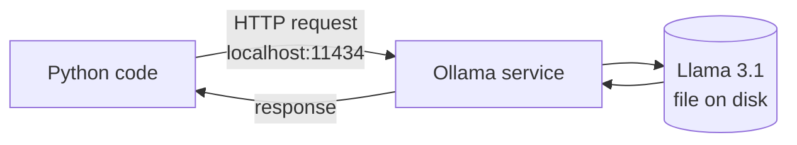
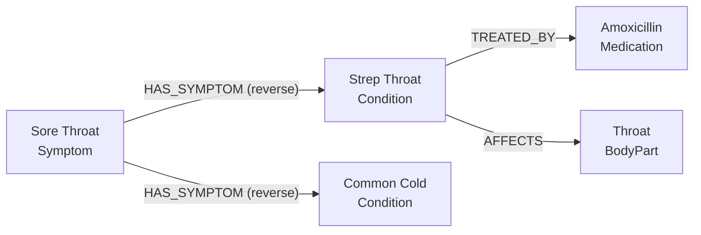
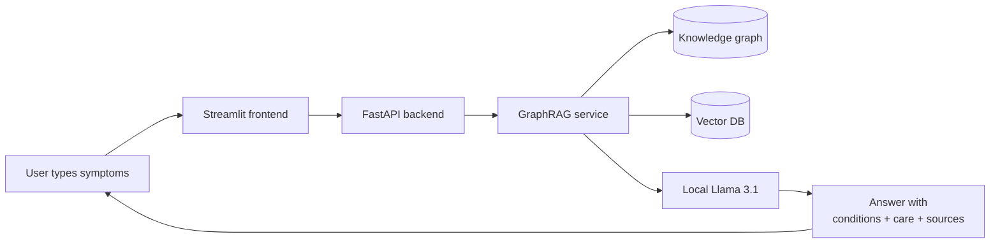
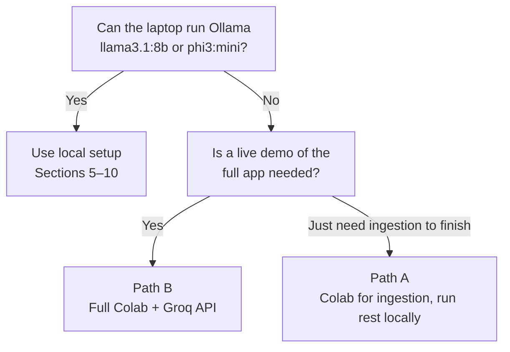

# Phase 0 — Setup & Foundations

**Duration:** Week 1 (around 5–8 hours of focused work per person)
**Goal:** Every team member has a fully working development environment, can run an LLM on their own laptop, can clone the project, and understands what the code does at a high level.

This phase produces no features. Skipping or rushing it tends to cause confusing failures in later phases.

---

## Table of Contents

1. [Overview](#1-overview)
2. [Definition of "done"](#2-definition-of-done)
3. [Time budget](#3-time-budget)
4. [Working principles](#4-working-principles)
5. [Step 1 — Install the core tools](#5-step-1--install-the-core-tools)
6. [Step 2 — Install Ollama and pull models](#6-step-2--install-ollama-and-pull-models)
7. [Step 3 — Clone the project repo](#7-step-3--clone-the-project-repo)
8. [Step 4 — Set up the backend environment](#8-step-4--set-up-the-backend-environment)
9. [Step 5 — Set up the frontend environment](#9-step-5--set-up-the-frontend-environment)
10. [Step 6 — Sanity checks](#10-step-6--sanity-checks)
11. [Step 7 — Concept primer](#11-step-7--concept-primer)
12. [Step 8 — Tour the codebase](#12-step-8--tour-the-codebase)
13. [Step 9 — Team setup on GitHub](#13-step-9--team-setup-on-github)
14. [Common errors and how to fix them](#14-common-errors-and-how-to-fix-them)
15. [Definition of Done — checklist](#15-definition-of-done--checklist)
16. [Demo](#16-demo)
17. [What's next](#17-whats-next)
18. [Appendix — Google Colab alternative](#18-appendix--google-colab-alternative)

---

## 1. Overview

Phase 0 establishes a uniform development environment across all team members. By the end of Week 1, each member should have:

- A laptop able to run a Large Language Model locally.
- A backend project runnable on port `8000`.
- A frontend project runnable on port `8501`.
- Access to a shared GitHub repository.
- A working mental model of the system as described in `GUIDE.md` sections 1–10.

A common failure mode in student projects is environment drift — different Python versions, different operating systems, half-installed tooling. Following this phase step-by-step prevents that.

---

## 2. Definition of "done"

By the end of Phase 0, each team member should be able to:

- Run `ollama run llama3.1:8b "Hello, who are you?"` and get a reply from a locally running LLM.
- Activate the backend virtual environment and run `python -c "import langchain, chromadb, networkx, fastapi"` with no errors.
- Activate the frontend virtual environment and run `python -c "import streamlit, requests"` with no errors.
- Open the project in an editor and navigate the folder structure.
- Explain in one sentence each: what an LLM is, what an embedding is, what a knowledge graph is.

No features are built in this phase. The goal is foundation only.

---

## 3. Time budget

Rough estimate per person:

| Task | Time |
|---|---|
| Install Python, Git, editor | 30 min |
| Install Ollama, pull models | 30–60 min (depends on internet) |
| Clone repo, create venvs, install packages | 30 min |
| Sanity-check everything | 30 min |
| Read Sections 1–10 of `GUIDE.md` | 60 min |
| Skim the codebase | 60 min |
| Concept primer (Section 11 below) | 45 min |
| Buffer for unexpected issues | 60–90 min |
| **Total** | **~6 hours** |

Spread across a week, this works out to roughly one hour per day.

---

## 4. Working principles

Three guidelines that apply throughout Phase 0.

**1. Read every error message twice.** Most Phase 0 issues are installation errors. The messages usually identify the cause when read carefully.

**2. If something works, do not change it.** Avoid replacing the suggested Python version or substituting tooling without reason. Reach a working state first; experiment afterwards.

**3. Ask for help after 30 minutes stuck.** Phase 0 should not consume disproportionate time on a single environment issue.

---

## 5. Step 1 — Install the core tools

> 💡 **Low-spec laptop, or prefer not to install anything locally?** Google Colab is a viable alternative — see the [Google Colab appendix](#18-appendix--google-colab-alternative) at the end of this document. The local setup below is still recommended where possible.

Four pieces of software are required.

### 5.1 Python 3.10 or 3.11

Python 3.10 or 3.11 is required. Python 2 is not supported, and some libraries used here do not yet support Python 3.13.

**Windows:**
Download from <https://www.python.org/downloads/>. During install, enable *"Add Python to PATH"*. Then in a new terminal:

```powershell
python --version
```

Expected output: something like `Python 3.11.9`.

**macOS:**
Homebrew is recommended:
```bash
brew install python@3.11
python3.11 --version
```

**Linux:**
Most distros ship Python. Verify the version is 3.10+:
```bash
python3 --version
```

Any version starting with `3.10`, `3.11`, or `3.12` is acceptable. `3.8` and `3.9` are too old; upgrade.

### 5.2 Git

Git is required for shared development.

- **Windows:** Download from <https://git-scm.com/download/win>. Default options are fine.
- **macOS:** Bundled with Xcode Command Line Tools. Running `git --version` will prompt for install if missing.
- **Linux:** `sudo apt install git` or the equivalent for the distro.

Verify:
```bash
git --version
```

### 5.3 A code editor

Recommended: **Visual Studio Code** — <https://code.visualstudio.com/>.

Recommended extensions:
- **Python** (Microsoft)
- **Pylance** (Microsoft)
- **GitLens** (useful for team work)
- **Markdown All in One** (for preview)

PyCharm or other editors are acceptable.

### 5.4 A terminal

- **Windows:** **PowerShell** (built-in) or **Windows Terminal** (free in the Microsoft Store). Avoid the legacy `cmd.exe`.
- **macOS / Linux:** The default terminal is fine. iTerm2 is a common alternative on macOS.

---

## 6. Step 2 — Install Ollama and pull models

### 6.1 What Ollama does

Ollama is a background program that runs on the local machine and serves Large Language Models. It is accessed over HTTP, similar to a cloud API, but runs entirely locally with no API key.



Ollama is a small webserver wrapped around model files on disk.

### 6.2 Installation

Download from <https://ollama.com/download> and run the installer. On Windows and macOS, Ollama runs as a tray/menu-bar application. On Linux it runs as a service.

Verify:
```bash
ollama --version
```

### 6.3 Pull the required models

Two models are needed. Combined download is approximately 5 GB.

```bash
ollama pull llama3.1:8b
ollama pull nomic-embed-text
```

The first is the **chat model** (Llama 3.1, 8 billion parameters). The second is the **embedding model** (explained in Section 11).

**Laptops with only 8 GB RAM:** `llama3.1:8b` may be too slow or unstable. Use a smaller model:
```bash
ollama pull phi3:mini
```
…and set `LLM_MODEL=phi3:mini` in `backend/.env` later.

### 6.4 Test the LLM

```bash
ollama run llama3.1:8b "Explain in one sentence what a sore throat is."
```

A sentence should be returned. Take a screenshot — it is part of the Phase 0 deliverable.

Press `Ctrl + D` to exit any interactive session Ollama may have started.

---

## 7. Step 3 — Clone the project repo

Obtain the GitHub repo URL from the team lead. Then:

```bash
cd ~/projects        # or any directory used for code
git clone <repo-url>
cd telemed-AI
```

Open the project in an editor:
```bash
code .
```

Expected top-level structure:

```
telemed-AI/
├── GUIDE.md
├── README.md
├── backend/
├── frontend/
├── data/
└── phase/
    └── PHASE_0.md
```

---

## 8. Step 4 — Set up the backend environment

> **Why two environments (backend + frontend)?**
> The two projects have different dependencies and run on different ports. Keeping them separate prevents updates in one from breaking the other and matches how the project would be deployed in production.

### 8.1 Create the backend virtual environment

A virtual environment (venv) is an isolated Python installation scoped to this project. It prevents the project's packages from interfering with the global Python install.

```bash
cd backend
python -m venv .venv
```

This creates a hidden `.venv/` directory. It is gitignored and must not be committed.

### 8.2 Activate the venv

**Windows (PowerShell):**
```powershell
.venv\Scripts\Activate.ps1
```

If a script-execution error appears, run this once and retry:
```powershell
Set-ExecutionPolicy -Scope CurrentUser -ExecutionPolicy RemoteSigned
```

**macOS / Linux:**
```bash
source .venv/bin/activate
```

A successful activation prefixes the terminal prompt with `(.venv)`.

> Every new terminal session for backend work must begin with venv activation.

### 8.3 Install backend packages

```bash
pip install -r requirements.txt
```

This step takes several minutes. On failure, see [Common errors](#14-common-errors-and-how-to-fix-them).

### 8.4 Create the `.env` file

```bash
# Windows
copy .env.example .env
# macOS / Linux
cp .env.example .env
```

Open `backend/.env` and review the contents. No edits are required at this stage. The file holds model names, ports, and other settings.

---

## 9. Step 5 — Set up the frontend environment

Open a **second** terminal (keeping the backend terminal open). Then:

```bash
cd telemed-AI/frontend
python -m venv .venv
```

Activate it using the same commands as in Section 8.2.

Install packages:
```bash
pip install -r requirements.txt
```

Create the `.env` file:
```bash
cp .env.example .env     # or `copy` on Windows
```

The frontend setup is complete.

---

## 10. Step 6 — Sanity checks

These checks confirm that each component can start. No features are exercised yet.

### 10.1 Ollama is reachable

```bash
curl http://localhost:11434/api/tags
```

Expected: JSON listing the installed models. If `curl` is not available on Windows, open <http://localhost:11434> in a browser — it should display *"Ollama is running"*.

### 10.2 Backend imports

In the backend terminal (venv active):
```bash
python -c "import langchain, langchain_ollama, langchain_chroma, chromadb, networkx, fastapi, pydantic; print('backend OK')"
```

Expected output: `backend OK`.

### 10.3 Frontend imports

In the frontend terminal (venv active):
```bash
python -c "import streamlit, requests; print('frontend OK')"
```

### 10.4 Backend boots

In the backend terminal:
```bash
uvicorn backend.app.main:app --reload --port 8000
```

Uvicorn should print *"Application startup complete"*. Open <http://localhost:8000/health> in a browser. Expected JSON:

```json
{
  "status": "ok",
  "llm_model": "llama3.1:8b",
  "embedding_model": "nomic-embed-text",
  "graph_loaded": false,
  "vector_store_loaded": false
}
```

`graph_loaded: false` is **expected** at this stage — the knowledge base is built in Phase 2. The goal here is only that the API boots.

Press `Ctrl + C` to stop the backend.

### 10.5 Frontend boots

In the frontend terminal:
```bash
streamlit run app.py
```

A browser tab should open at <http://localhost:8501>. The chat UI loads but cannot reach the backend unless the backend is also running. This is expected at this stage.

Press `Ctrl + C` to stop it.

If all five checks pass, the environment is correctly set up.

---

## 11. Step 7 — Concept primer

This section builds a working mental model of the components used throughout the project. No coding here.

### 11.1 Large Language Model

A Large Language Model (LLM) is a neural network trained to predict the next token (roughly, the next word) in a sequence of text. After training on large text corpora, it produces fluent language on most topics.

The model used here — **Llama 3.1 8B** — has 8 billion trainable parameters stored in a single file. When prompted, the file is loaded into RAM and a large number of matrix operations produce each token of the reply.

**Important property:** LLMs have no notion of truth. They model patterns in text. If many sources state something incorrectly, the model is likely to repeat it. This is called **hallucination** and is the reason this project uses RAG/GraphRAG.

### 11.2 Embedding

An embedding is a function that maps a piece of text to a fixed-length list of numbers (a vector). Embedding models are trained so that texts with similar meaning produce vectors that point in similar directions.

Example (illustrative; real vectors here have 768 dimensions):

| Text | Vector |
|---|---|
| "I have a sore throat" | `[0.12, -0.84, 0.33, ...]` |
| "My throat hurts" | `[0.10, -0.82, 0.31, ...]` — very close to above |
| "How to bake a cake" | `[-0.55, 0.21, 0.97, ...]` — far from above |

The embedding model used here, `nomic-embed-text`, is separate from the chat LLM. It only produces embeddings.

Embeddings enable **similarity search**: given a question's vector, the closest document vectors can be retrieved efficiently. This is the role of a **vector database**.

### 11.3 Knowledge graph

A knowledge graph stores facts as a network of **nodes** (entities) connected by **edges** (relationships).



The graph captures structure that plain text loses: *"sore throat is a symptom of both strep throat and the common cold"*. Given a user complaint about a sore throat, the system can traverse the graph from `Sore Throat` to enumerate related conditions.

This traversal is the core of **GraphRAG** and the project's most distinctive component.

### 11.4 What the project does, end to end



The boxes are introduced in this phase. The arrows are built across Phases 1–5.

---

## 12. Step 8 — Tour the codebase

Spend roughly 30 minutes opening files. The goal is to locate components, not to understand every line.

Suggested reading order:

1. **`README.md`** — quickstart.
2. **`GUIDE.md`** sections 1–10 — full read, top to bottom.
3. **`backend/app/config.py`** — central settings (~30 lines).
4. **`backend/app/main.py`** — FastAPI entrypoint.
5. **`backend/app/api/routes.py`** — the two exposed endpoints.
6. **`backend/app/services/graph_rag.py`** — read the docstring; defer the body.
7. **`backend/app/services/prompts.py`** — what the LLM is shown.
8. **`frontend/app.py`** — full read (~100 lines).

At the top of each file, leave a single-line comment such as `# Read 2026-05-XX — understand: structure / 50% / not yet`. This serves as a per-file progress marker.

---

## 13. Step 9 — Team setup on GitHub

Plan to spend 30 minutes as a team on this section.

### 13.1 Roles

Decide on roles based on `GUIDE.md` §12. *Owning* a part of the system means being the point of contact for issues in that area — not exclusive write access.

| Role | Member |
|---|---|
| Data engineer | _________ |
| Graph engineer | _________ |
| Retrieval / LLM engineer | _________ |
| Backend engineer | _________ |
| Frontend engineer | _________ |
| Evaluation lead (rotated) | _________ |

Fill the table in and pin it to the team's chat channel.

### 13.2 Branch protection

Configure the GitHub repo so that:

- `main` is **protected**: no direct pushes.
- Pull requests require at least one reviewer's approval.
- Squash-merge is the default merge method.

### 13.3 First commit

Each member should:

1. Create a personal feature branch:
   ```bash
   git checkout -b feature/<your-name>-phase-0
   ```
2. Add the per-file `# Read ...` comments from Section 12.
3. Commit and push:
   ```bash
   git add .
   git commit -m "phase-0: read setup, dev environment ready"
   git push -u origin feature/<your-name>-phase-0
   ```
4. Open a **draft PR** on GitHub. Title: `Phase 0 — <your name> setup complete`.
5. Assign a teammate as reviewer.

The objective is procedural: every member opens at least one PR before substantive coding begins.

---

## 14. Common errors and how to fix them

### "Python is not recognised as an internal or external command" (Windows)

Python is not on PATH. Re-run the Python installer and enable *"Add Python to PATH"*.

### `pip install` fails with `error: Microsoft Visual C++ 14.0 or greater is required`

Some packages compile C extensions. Install the **Visual Studio Build Tools** (free): <https://visualstudio.microsoft.com/visual-cpp-build-tools/>. During install, select *"Desktop development with C++"*. Re-run `pip install -r requirements.txt`.

### `lxml` will not install

macOS:
```bash
xcode-select --install
pip install lxml
```
Linux (Debian/Ubuntu):
```bash
sudo apt install libxml2-dev libxslt1-dev
```

### `ollama: command not found` after install

Restart the terminal. If still missing on macOS, install via Homebrew: `brew install ollama`.

### Ollama is running but `ollama pull` hangs

Likely a firewall or VPN blocking the CDN. Try a personal hotspot.

### `Activate.ps1 cannot be loaded because running scripts is disabled` (PowerShell)

Run once:
```powershell
Set-ExecutionPolicy -Scope CurrentUser -ExecutionPolicy RemoteSigned
```

### `ModuleNotFoundError: No module named 'X'` when running the backend

The venv is not active. The prompt should begin with `(.venv)`. Activate and retry.

### Backend boots but `http://localhost:8000/health` returns `Connection refused`

Check the Uvicorn log. The most frequent cause is that Ollama is not running. Start Ollama and retry.

### Streamlit opens but shows a blank page

Open the browser's developer console (F12) and look for errors. Most often a backend timeout — confirm the backend is running on port 8000.

### "Permission denied" when pulling a model

Run the terminal as administrator (Windows) or with `sudo` once (macOS/Linux).

---

## 15. Definition of Done — checklist

Phase 0 is complete when every member can tick all of these:

- [ ] Python 3.10 or 3.11 is installed.
- [ ] Git is installed and the repo can be cloned.
- [ ] An editor with Python tooling is installed.
- [ ] Ollama is installed and `ollama --version` works.
- [ ] Both `llama3.1:8b` (or `phi3:mini`) and `nomic-embed-text` are pulled.
- [ ] `ollama run llama3.1:8b "Hello"` returns a reply, with a screenshot saved.
- [ ] The project repo is cloned locally.
- [ ] The backend venv is created and `backend/requirements.txt` is installed without errors.
- [ ] `backend/.env` exists, copied from `.env.example`.
- [ ] The frontend venv is created and `frontend/requirements.txt` is installed without errors.
- [ ] `frontend/.env` exists, copied from `.env.example`.
- [ ] All five sanity checks in [Section 10](#10-step-6--sanity-checks) pass.
- [ ] `GUIDE.md` sections 1–10 have been read.
- [ ] Every file listed in [Section 12](#12-step-8--tour-the-codebase) has been skimmed.
- [ ] One-sentence explanations of LLM, embedding, vector database, and knowledge graph are clear to the member.
- [ ] The team has agreed on roles.
- [ ] At least one draft PR has been opened to the team repo.

When all boxes are ticked, post to the team channel with the Ollama screenshot attached.

---

## 16. Demo

End-of-Week-1 walkthrough (5 minutes per person):

1. Run `ollama run llama3.1:8b "What is a sore throat?"` and show the answer.
2. Open the backend folder. Activate the venv. Run `uvicorn backend.app.main:app --reload --port 8000`.
3. Open <http://localhost:8000/health> in a browser. Show the JSON response.
4. In a second terminal, open the frontend folder. Activate the venv. Run `streamlit run app.py`.
5. Show the empty chat UI in the browser.
6. Show the GitHub draft PR.
7. Explain in plain language what the project will do (refer to the diagram in Section 11.4).

All seven steps demonstrated = ready to begin Phase 1.

---

## 17. What's next

**Phase 1 (Weeks 2–3)** focuses on the data pipeline:

- Downloading the MedlinePlus health-topics XML.
- Parsing it into a clean JSONL file.
- Splitting it into chunks ready for embedding.
- Writing an exploratory data analysis notebook.

The output of Phase 1 is a clean corpus of approximately 1,000 medical topics, split into approximately 5,000 chunks, ready for the knowledge graph step in Phase 2.

---

## 18. Appendix — Google Colab alternative

For members whose laptops cannot run a local LLM (typically <8 GB RAM, no GPU, slow CPU) or who prefer a cloud-only setup, Google Colab is a viable alternative — with adaptations.

### 18.1 Trade-offs

| Aspect | Local (Ollama) | Google Colab |
|---|---|---|
| Cost | Free | Free tier (with limits) |
| Speed | Slow on CPU laptops | Faster (Colab CPU/GPU) |
| Always available | Yes | Sessions disconnect after ~90 min idle / 12 h max |
| Persistence | Files stay on the laptop | Wiped between sessions unless saved to Google Drive |
| Network | Localhost, simple | Requires tunnelling (ngrok) to expose backend / frontend |
| Privacy | Fully local | Code and prompts go through Google's servers |

### 18.2 Two practical paths



**Path A — Colab for slow ingestion only (recommended).**
Do everything else on the laptop. Use Colab only to run Phase 2's slow graph build (which makes ~1 LLM call per chunk). Download the resulting `data/graph/kg.pickle` and `data/chroma/` folder from Colab to the local `data/` directory and continue locally.

- Pros: minimal project changes; local backend/frontend stay simple.
- Cons: still need to run Ollama (or a cloud LLM) somewhere for the runtime answer pipeline.

**Path B — Run everything in Colab with a cloud LLM API.**
Swap Ollama for a free cloud LLM API (Groq has a generous free tier and very fast inference; Google Gemini is another option). Run backend and frontend inside the Colab notebook itself.

- Pros: no local Python or Ollama install needed.
- Cons: more project tweaks; sessions reset; state must live in Google Drive.

### 18.3 Path B — full Colab setup

1. **Open a new Colab notebook** at <https://colab.research.google.com>.
2. **Mount Google Drive** so `data/` survives between sessions:
   ```python
   from google.colab import drive
   drive.mount('/content/drive')
   ```
3. **Clone the repo into Drive** (one time):
   ```python
   !cd /content/drive/MyDrive && git clone <repo-url>
   %cd /content/drive/MyDrive/telemed-AI
   ```
4. **Install dependencies:**
   ```python
   !pip install -r backend/requirements.txt -r frontend/requirements.txt langchain-groq langchain-huggingface pyngrok
   ```
5. **Get a free Groq API key** at <https://console.groq.com/keys>:
   ```python
   import os
   os.environ["GROQ_API_KEY"] = "gsk_..."
   ```
6. **Swap the LLM wrapper** — edit `backend/app/services/llm.py`:
   ```python
   from langchain_groq import ChatGroq
   from backend.app.config import LLM_MODEL

   def get_llm(temperature: float = 0.2):
       return ChatGroq(model=LLM_MODEL, temperature=temperature)
   ```
7. **Swap the embedding wrapper** — edit `backend/app/services/embeddings.py` to use HuggingFace (free, no API key):
   ```python
   from langchain_huggingface import HuggingFaceEmbeddings

   def get_embeddings():
       return HuggingFaceEmbeddings(
           model_name="nomic-ai/nomic-embed-text-v1.5",
           model_kwargs={"trust_remote_code": True},
       )
   ```
8. **Update `backend/.env`:**
   ```
   LLM_MODEL=llama-3.1-8b-instant
   ```
9. **Start the backend with an ngrok tunnel** so the frontend can reach it:
   ```python
   from pyngrok import ngrok
   public_url = ngrok.connect(8000)
   print("Backend URL:", public_url)
   !uvicorn backend.app.main:app --port 8000 &
   ```
10. **Run the frontend.** Two options:
    - **Run Streamlit locally** on the laptop, with `BACKEND_URL` in `frontend/.env` pointed at the ngrok URL printed above.
    - **Run Streamlit inside Colab** with its own ngrok tunnel on port 8501.

### 18.4 Sanity checks (Colab variant)

The same checks from [Section 10](#10-step-6--sanity-checks) apply, with these substitutions:

- `ollama --version` is replaced by a quick LLM call:
  ```python
  from backend.app.services.llm import get_llm
  print(get_llm().invoke("Hello").content)
  ```
- The backend `/health` endpoint is reached via the ngrok URL, not `http://localhost:8000`.

### 18.5 Limitations and gotchas

- **Sessions time out.** A free Colab session disconnects after ~90 minutes idle or 12 hours total. After disconnect, re-mount Drive and restart the backend.
- **State must live in Drive.** Anything written to `/content/` is wiped at session end. Always write to `/content/drive/MyDrive/telemed-AI/data/`.
- **ngrok URL changes on every session** (free tier). The frontend's `BACKEND_URL` must be updated each time.
- **Streamlit on Colab is awkward.** Frontend on the local laptop pointing at the Colab backend is the smoother setup.
- **Ingestion is still slow.** Even with Groq's fast inference, ~5,000 chunks × ~1 second per call = ~30–90 minutes. Run ingestion once, save artifacts to Drive, reuse across sessions.

### 18.6 When NOT to use Colab

- The laptop has ≥8 GB RAM and can install Ollama — local is simpler and more stable.
- The team is collaborating in real time — mixed local/Colab setups complicate debugging and reviews.
- Privacy is a concern — Colab and Groq both send prompts through third-party servers.
